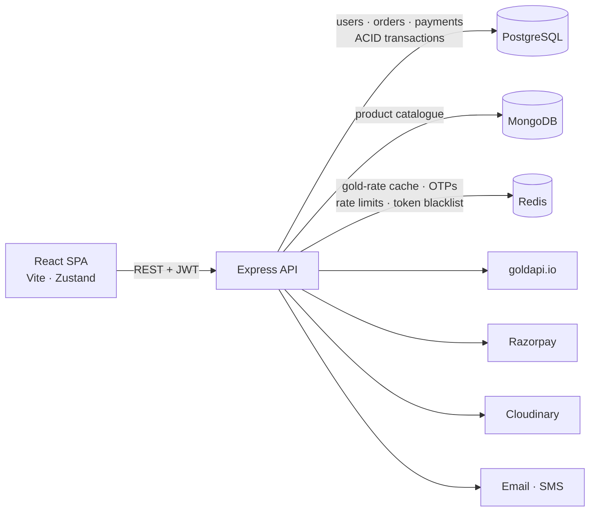

# 💍 Kanakam Fine Jewellery

> A full-stack jewellery store where prices follow the **live gold rate** — with Razorpay checkout, OTP and email-verified auth, and an admin dashboard.


---

## Contents

- [Overview](#overview)
- [Architecture](#architecture)
- [Engineering highlights](#engineering-highlights)
- [Pricing engine](#pricing-engine)
- [Tech stack](#tech-stack)
- [Getting started](#getting-started)
- [Testing](#testing)
- [API overview](#api-overview)
- [Deployment](#deployment)
- [License](#license)

---

## Overview

Jewellery isn't sold at a fixed price: a 22K ring costs its weight in gold at today's rate, plus making charges, stones and 3% GST. Kanakam models that directly. A background job pulls the gold rate, reprices the whole catalogue, and checkout charges exactly the price the customer saw — locking the rate into the order so it never changes afterwards.

**Customers** can browse and filter the catalogue by category, metal, karat and live price, pay with Razorpay (UPI, cards, netbanking), track orders, and sign in with email + password or a phone OTP.

**Admins** get a dashboard (revenue, orders, users, low-stock alerts), product management with Cloudinary image uploads, order status updates that email the customer, and refunds.

---

## Architecture



**Why two databases?** Money needs transactions and foreign keys: users, orders, order items and payments live in **PostgreSQL** (Sequelize). Products have flexible, nested attributes (stones, images, occasions) and are read far more than written, so the catalogue lives in **MongoDB** (Mongoose). **Redis** holds everything short-lived.

The backend is organised by feature module (`auth`, `products`, `pricing`, `orders`, `payments`, `notifications`, `users`, `admin`), each with its own routes, controller, service and model.

---

## Engineering highlights

### Payments you can't fake
- Razorpay signatures are verified server-side with **HMAC-SHA256**, compared in constant time (`crypto.timingSafeEqual`).
- Verification is bound to the order: the Razorpay order id must match the one issued for *that* order and *that* user, so a valid signature from a cheap order can't mark an expensive one as paid. Re-verifying a paid order is a no-op.

### Checkout that can't oversell
- Stock is reserved with a **single conditional MongoDB update** (`stock >= quantity`), so two buyers can never both take the last piece.
- Orders span two databases, so checkout uses a **compensating action**: stock is reserved in MongoDB, the order and its items are written in one **PostgreSQL transaction**, and if anything fails the reserved stock is released.
- Each order stores a **snapshot** of the gold rates and product details at purchase time.

### Authentication
- JWT sessions; passwords hashed with **bcrypt (12 rounds)**.
- **Email verification**: a random 256-bit token is emailed; Redis stores only its **SHA-256 hash** with a **24-hour TTL**, and the link works once.
- **OTP flows** (phone login, password reset) generated with a CSPRNG, stored in Redis with a TTL, limited to 3 wrong attempts and 3 requests per window.
- Logout **blacklists the token** in Redis until it expires.
- **Redis-backed rate limiting** on all auth routes (20 requests / 15 min per IP), shared across server instances.

### Production basics
- `helmet` security headers, CORS allow-list from config, central error handler that hides internals in production.
- `/health` reports PostgreSQL, MongoDB and Redis status separately (503 when degraded).
- Email goes out over SMTP or the **Brevo HTTP API** (for hosts that block SMTP).

---

## Pricing engine

```text
Gold value   = net weight (g) × live rate for the product's karat
Stone value  = sum of gemstone / diamond prices
Subtotal     = gold value + making charges + stone value
GST          = 3% of subtotal
Final price  = subtotal + GST            (silver/platinum: no gold value)
```

- **One API call per cycle**: the 24K price per gram is fetched once and every karat is derived from its purity (22K = 91.6%, 18K = 75%, 14K = 58.3%). Rates are cached in Redis for `GOLD_RATE_TTL_SECONDS` (default 15 min), with fallback rates if the API is down.
- **Prices are stored, not just calculated on screen**: each cycle the catalogue is repriced with one `bulkWrite` into `base_price` (indexed), so filtering and sorting by price happen in the database.
- **One formula everywhere**: the product list, the price API and checkout all call the same `priceProduct()` function. Units are rounded to whole rupees before multiplying by quantity, so the charge is always exactly the listed price × quantity.

---

## Tech stack

| Layer | Tools |
| :--- | :--- |
| Frontend | React 19, Vite, Zustand, React Router 7, Tailwind CSS, React Hook Form, Lucide, React Hot Toast |
| Backend | Node.js 20+, Express 5, Sequelize, Mongoose, ioredis, JWT, bcryptjs, Multer, helmet, morgan |
| Data | PostgreSQL, MongoDB, Redis |
| Integrations | Razorpay, goldapi.io, Cloudinary, Nodemailer / Brevo, MSG91 |
| Quality | Jest, Supertest, GitHub Actions |

---

## Getting started

### Prerequisites
- Node.js 20.19+ (22 recommended)
- Docker (for PostgreSQL, MongoDB and Redis), or your own instances

### 1. Start the databases
```bash
docker compose up -d
```

### 2. Backend
```bash
cd Backend
cp .env.example .env      # fill in keys — every variable is documented there
npm install
npm run dev               # http://localhost:3000
```
Optional seed data:
```bash
node seed-products.js     # sample catalogue (MongoDB)
node seed-admin.js        # admin account from ADMIN_EMAIL / ADMIN_PASSWORD in .env
```

In development, OTPs and email verification links are printed to the terminal, so you don't need SMS or email set up to try the flows.

### 3. Frontend
```bash
cd frontend
cp .env.example .env      # VITE_API_BASE_URL=http://localhost:3000/api
npm install
npm run dev               # http://localhost:5173
```

Use [Razorpay test cards](https://razorpay.com/docs/payments/payments/test-card-details/) to try checkout.

---

## Testing

```bash
cd Backend
npm test
```

35 tests run without any databases (Redis is replaced by an in-memory fake, models are mocked). They cover the pricing formula and rate caching, payment signature and order binding, email verification tokens, atomic stock reservation and rollback, rate limiting, CORS and security headers. CI runs the tests and the frontend build on every push.

---

## API overview

| Area | Endpoints |
| :--- | :--- |
| Auth | `POST /api/auth/register` · `login` · `send-otp` · `verify-otp` · `forgot-password` · `reset-password` · `verify-email` · `resend-verification` · `logout` · `GET/PUT /api/auth/me` |
| Products | `GET /api/products` (filters: category, metal, karat, price, weight, search, sort) · `GET /api/products/:id` · admin CRUD, stock and image routes |
| Pricing | `GET /api/pricing/gold-rates` · `GET /api/pricing/gold-rate?karat=22` · `GET /api/pricing/product/:id` · `POST /api/pricing/calculate` · `POST /api/pricing/refresh` (admin) |
| Orders | `POST /api/orders` · `GET /api/orders/my-orders` · `GET /api/orders/:id` · `POST /api/orders/:id/cancel` · admin list and status updates |
| Payments | `POST /api/payments/initiate` · `POST /api/payments/verify` · `GET /api/payments/:orderId` · `POST /api/payments/refund` (admin) |
| Admin | `GET /api/admin/stats` |
| Health | `GET /health` |

---

## Deployment

The app runs on free tiers:

| Part | Service | Notes |
| :--- | :--- | :--- |
| Frontend | Vercel | root `frontend`; `vercel.json` handles SPA routes; set `VITE_API_BASE_URL` |
| Backend | Render | root `Backend`; start `npm start`; set the variables from `.env.example` |
| PostgreSQL | Neon / Supabase | set `DATABASE_URL` (SSL on by default) |
| MongoDB | MongoDB Atlas | set `MONGO_URI` |
| Redis | Upstash | set `REDIS_URL` (`rediss://...`) |
| Email | Brevo | set `BREVO_API_KEY` — Render's free tier blocks SMTP |

On goldapi.io's free plan (~100 requests/month), set `GOLD_RATE_TTL_SECONDS=21600` (6 hours).

---

## License

[MIT](LICENSE) © 2026 Naitik Garg
